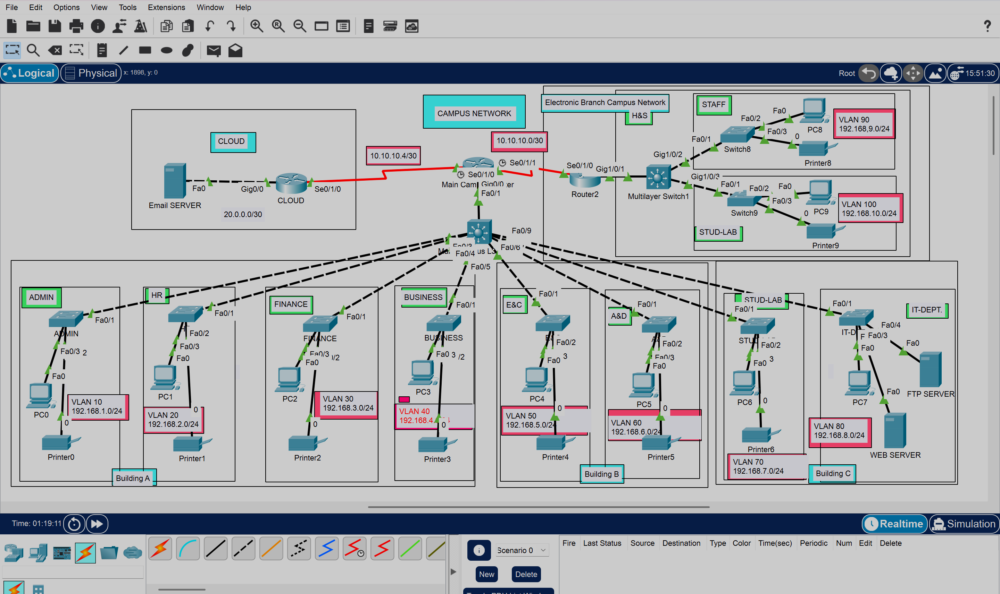

# Campus Network Design & Implementation
 
Designed and implemented a large-scale university network across two geographically separate campuses in Cisco Packet Tracer. This is the most complex project in the series, it uses a three-tier hierarchical network model, covers multiple buildings and departments, connects two campuses over serial WAN links, and includes an externally hosted email server simulated on the cloud side.
 
---
 
## Scenario
 
University has a main campus and a smaller branch campus situated 20 miles apart. The university serves students and staff across four faculties: Health and Sciences, Business, Engineering and Computing, and Arts and Design.
 
The main campus is split across three buildings. Building A holds four departments, Building B holds two, and Building C holds two more including the IT department which hosts the university's internal web server. The branch campus hosts the Faculty of Health and Sciences with staff and student labs on separate floors. On top of all that, there is an external email server hosted on the cloud that the whole university network needs to be able to reach.
 
The task was to plan, design, and implement the full network from scratch topology design, IP addressing, device configuration, routing, and end-to-end verification.
 
---
 
## Network Topology
 

 
---
 
## Requirements
 
- Main campus has three buildings A, B, and C
- Building A: Admin, HR, Finance, Business (4 departments)
- Building B: Engineering & Computing, Arts & Design (2 departments)
- Building C: Student Labs, IT Department (2 departments)
- IT department hosts the university web server and internal servers
- External email server hosted on the cloud
- Branch campus: Faculty of Health and Sciences, Staff and Student Labs
- Hierarchical three-tier network model applied throughout
- Each department on its own VLAN and separate IP network
- Switches configured with appropriate VLANs
- RIPv2 used as the routing protocol across the internal network
- Static routing used to reach the external cloud server
- Devices in Building A obtain IP addresses via DHCP from the router
- All devices across both campuses must communicate with each other
- End-to-end access to both internal and external servers required
---
 
## Network Design Approach
 
The network follows a three-tier hierarchical model:
 
- **Core layer** routers handling inter-campus and external connectivity via serial WAN links
- **Distribution layer** Cisco 3650 multilayer switches, one per campus, handling inter-VLAN routing and uplink to the router
- **Access layer** Cisco 2960 switches, one per department, with all ports assigned to the correct VLAN
This keeps the design clean and scalable. Traffic stays local within a department until it needs to go somewhere else, at which point it moves up through the L3 switch and out through the router.
 
---
 
## IP Addressing
 
### Main Campus Building A
 
| Department | VLAN | Network | Default Gateway |
|------------|------|---------|-----------------|
| Admin | 10 | 192.168.1.0/24 | 192.168.1.1 |
| HR | 20 | 192.168.2.0/24 | 192.168.2.1 |
| Finance | 30 | 192.168.3.0/24 | 192.168.3.1 |
| Business | 40 | 192.168.4.0/24 | 192.168.4.1 |
 
### Main Campus Building B
 
| Department | VLAN | Network | Default Gateway |
|------------|------|---------|-----------------|
| Engineering & Computing | 50 | 192.168.5.0/24 | 192.168.5.1 |
| Arts & Design | 60 | 192.168.6.0/24 | 192.168.6.1 |
 
### Main Campus Building C
 
| Department | VLAN | Network | Default Gateway |
|------------|------|---------|-----------------|
| Student Labs | 70 | 192.168.7.0/24 | 192.168.7.1 |
| IT Department | 80 | 192.168.8.0/24 | 192.168.8.1 |
 
### Branch Campus Faculty of Health and Sciences
 
| Department | VLAN | Network | Default Gateway |
|------------|------|---------|-----------------|
| Staff | 90 | 192.168.9.0/24 | 192.168.9.1 |
| Student Labs | 100 | 192.168.10.0/24 | 192.168.10.1 |
 
### Serial WAN Links
 
/30 subnets are used on all serial links since point-to-point connections only need two usable host addresses.
 
| Link | Network | Side A | Side B |
|------|---------|--------|--------|
| Main Campus ↔ Branch Campus | 10.10.10.0/30 | 10.10.10.1 (Main) | 10.10.10.2 (Branch) |
| Main Campus ↔ Cloud Router | 20.0.0.0/30 | 20.0.0.1 (Main) | 20.0.0.2 (Cloud) |
 
---
