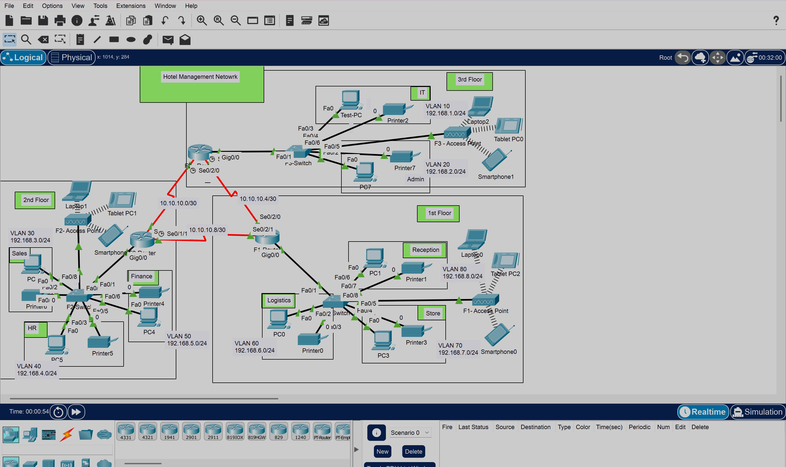

# Hotel Management Network Design & Implementation
 
Designed and implemented a multi-floor enterprise network for a hotel in Cisco Packet Tracer. This project is a step up in complexity, three routers connected over serial WAN links, OSPF for dynamic routing, SSH for secure remote management, and layer 2 port security on a specific switch port in the IT department.
 
---
 
## Scenario
 
Vic Modern Hotel needed a full network built across three floors, with multiple departments on each floor, wired and wireless connectivity, a printer per department, and centralized IP address management. Every department had to be on its own VLAN, all devices had to get addresses automatically, and everything across all three floors had to be reachable end to end.
 
On top of the standard setup, the IT department required SSH-only access to all routers and a locked down switch port that only allows one specific device to connect.
 
---
 
## Network Topology
 
```
     [ F3-Router ]-----Serial 10.10.10.0/30-----[ F2-Router ]
           |                                          |
  Serial 10.10.10.8/30                    Serial 10.10.10.4/30
           |                                          |
     [ F1-Router ]-------------------------------------
           |                  |                   |
     [ F1-Switch ]      [ F2-Switch ]       [ F3-Switch ]
      /    |    \         /    |    \         /         \
   V80   V70   V60     V50   V40   V30      V10        V20
 Recept Store Logi   Finan   HR   Sales     IT         Admin
                                             |
                                         [ Test PC ]
                                         Port Security
```
 
 
## Network Topology
 

 
 
---
 
## Requirements
 
- Three routers, one per floor, connected via serial DCE cables
- One switch per floor
- Wireless access on every floor for laptops and phones
- One printer per department
- Eight VLANs total, one per department
- OSPF as the routing protocol across all routers
- Each router acts as the DHCP server for its own floor
- All devices across all floors must communicate with each other
- SSH on all routers, telnet not permitted
- IT department switch port locked to one device using port security
---
 
## IP Addressing
 
### Floor 1
 
| Department | VLAN | Network | Default Gateway |
|------------|------|---------|-----------------|
| Reception | 80 | 192.168.8.0/24 | 192.168.8.1 |
| Store | 70 | 192.168.7.0/24 | 192.168.7.1 |
| Logistics | 60 | 192.168.6.0/24 | 192.168.6.1 |
 
### Floor 2
 
| Department | VLAN | Network | Default Gateway |
|------------|------|---------|-----------------|
| Finance | 50 | 192.168.5.0/24 | 192.168.5.1 |
| HR | 40 | 192.168.4.0/24 | 192.168.4.1 |
| Sales & Marketing | 30 | 192.168.3.0/24 | 192.168.3.1 |
 
### Floor 3
 
| Department | VLAN | Network | Default Gateway |
|------------|------|---------|-----------------|
| IT | 10 | 192.168.1.0/24 | 192.168.1.1 |
| Admin | 20 | 192.168.2.0/24 | 192.168.2.1 |
 
### Serial WAN Links
 
/30 subnets are used on serial links since point-to-point connections only need two usable host addresses.
 
| Link | Network | Side A | Side B |
|------|---------|--------|--------|
| F1 ↔ F2 | 10.10.10.4/30 | 10.10.10.5 (F1) | 10.10.10.6 (F2) |
| F1 ↔ F3 | 10.10.10.8/30 | 10.10.10.9 (F1) | 10.10.10.10 (F3) |
| F2 ↔ F3 | 10.10.10.0/30 | 10.10.10.1 (F2) | 10.10.10.2 (F3) |
 
---
